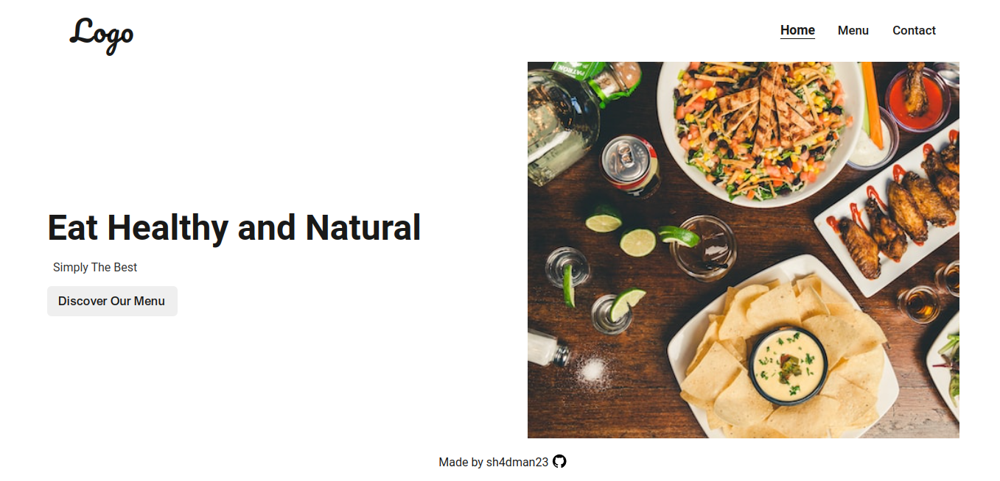

# Restaurant Page


This is a dummy restaurant page created as a project for [The Odin Project](https://www.theodinproject.com/). The
main goal of this project was to make a multi-page site using WebPack to bundle JavaScript files to generate entire
contents of the website.

A live demo of the project is available [here](https://sh4dman23.github.io/restaurant-page).

## Getting Started
To use this project locally, first clone this repository on your machine using `git clone git@github.com:sh4dman23/
restaurant-page.git`. Then execute the following commands inside the project directory to start a live server:
```bash
# Install dependencies
npm install

# Run this to start a live server
npm run start

# Alternatively, run this to recreate the distribution files
npm run build
```
Additionally, you can change the menu items in [common.js](./src/common.js).

## License
This project is licensed under MIT License. See [LICENSE](./LICENSE) for more information.

## Acknowledgements
- [The Odin Project](https://www.theodinproject.com/)
- Image assets used:
    - Home Page Photo by [Tim Toomey](https://unsplash.com/@covertnine?utm_content=creditCopyText&utm_medium=referral&utm_source=unsplash) on [Unsplash](https://unsplash.com/photos/sliced-bread-on-white-ceramic-plate-STqHLqMne3k?utm_content=creditCopyText&utm_medium=referral&utm_source=unsplash)
    - Menu Page Photo by [Mgg Vitchakorn](https://unsplash.com/@mggbox?utm_content=creditCopyText&utm_medium=referral&utm_source=unsplash) on [Unsplash](https://unsplash.com/photos/roasted-meat-served-on-white-ceramic-plates-DDn9I5V1ubE?utm_content=creditCopyText&utm_medium=referral&utm_source=unsplash)
    - Contact Page Photo by [Jason Leung](https://unsplash.com/@ninjason?utm_content=creditCopyText&utm_medium=referral&utm_source=unsplash) on [Unsplash](https://unsplash.com/photos/photo-of-pub-set-in-room-during-daytime-poI7DelFiVA?utm_content=creditCopyText&utm_medium=referral&utm_source=unsplash)
- Vector Assets by [Pictogrammers](https://pictogrammers.com/)